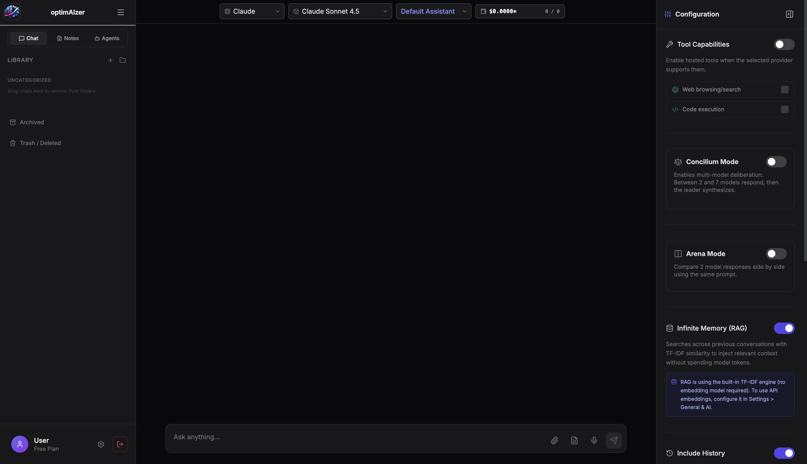
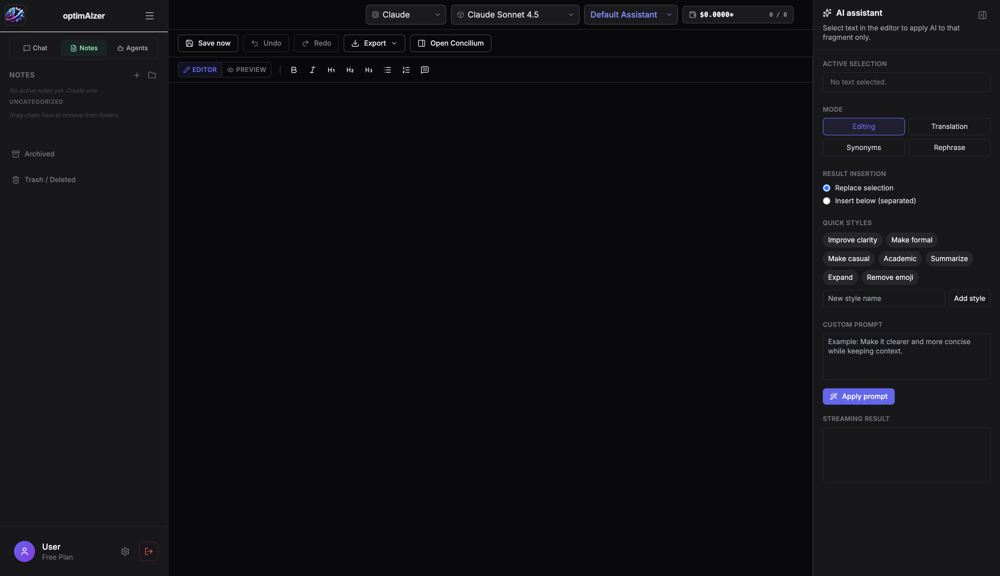
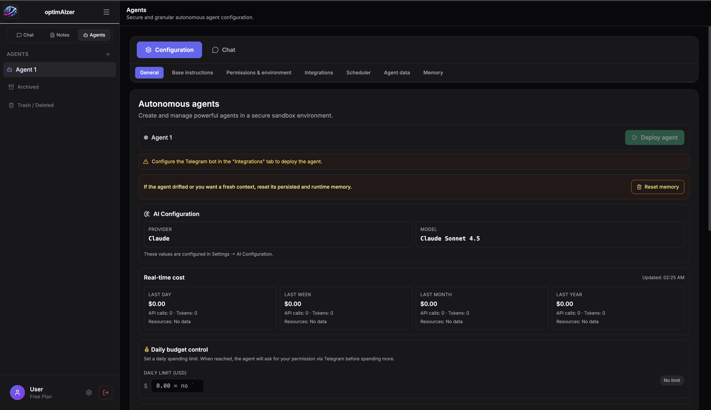
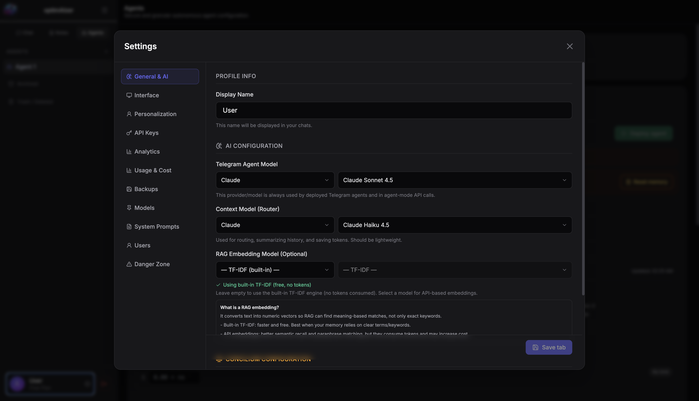

# optimAIzer

<p align="center">
  
</p>

optimAIzer is a local-first AI workspace with chat, notes, autonomous agents, and multi-provider model orchestration. It includes a React frontend, a Node/Express backend, SQLite persistence, local authentication, and optional Docker/Electron deployment.

## Preview

<p align="center">
  <br>
  <br>
  <br>
  
</p>

## Table of Contents
1. [Preview](#preview)
2. [What this app includes](#what-this-app-includes)
3. [Quick installation](#quick-installation)
4. [First run](#first-run)
5. [Docker deployment (port 7189)](#docker-deployment-port-7189)
6. [Desktop app for macOS (Electron)](#desktop-app-for-macos-electron)
7. [Main features](#main-features)
8. [New capabilities](#new-capabilities)
9. [Project structure](#project-structure)
10. [Useful commands](#useful-commands)
11. [Tests](#tests)
12. [Security notes for GitHub publishing](#security-notes-for-github-publishing)
13. [Common issues](#common-issues)

## What this app includes
- **Frontend (React + Vite):** chat, notes, and agent workspaces.
- **Backend (Node + Express + SQLite):** auth, sessions, API routes, persistence, and security middleware.
- **Local authentication:** username/password login with role-aware behavior.
- **Local storage:** state and app data under `data/`.

## Quick installation

### 1) Requirements
- **Node.js 20+** ([https://nodejs.org](https://nodejs.org)).
- A terminal opened at project root.

### 2) Install everything

```bash
npm run install:all
```

This installs dependencies for both frontend and backend.

### 3) Configure environment variables
1. Copy `.env.example` to `.env`.
2. Add API keys if you will use cloud providers (OpenAI, Anthropic, Google, Groq, OpenRouter, etc.).
3. Keep `.env` private and never commit it.

## First run

```bash
npm run dev
```

This starts both services:
- Web app: `http://localhost:3000`
- Backend API: `http://localhost:3001`

### Default credentials
On first boot, the app creates:
- Username: `admin`
- Password: `admin`

Change the password immediately after login.

## Docker deployment (port 7189)

The repository includes:
- A multi-stage `Dockerfile` for frontend + backend build.
- A `docker-compose.yml` with a single service (`optimaizer`) exposed on `7189`.

### 1) Prepare environment
1. Copy `.env.example` to `.env`.
2. Set your API keys if needed.

### 2) Start service

```bash
docker compose up --build -d
```

Access:
- App + API: `http://localhost:7189`

### 3) Follow logs

```bash
docker compose logs -f
```

### 4) Stop service

```bash
docker compose down
```

## Desktop app for macOS (Electron)

Two supported modes:
- **Web mode:** frontend at `3000`, backend at `3001`.
- **Desktop mode:** Electron app wrapping the same UI.

### Desktop development

```bash
npm run desktop:dev
```

### Desktop production run

```bash
npm run build
npm run desktop:start
```

### Build macOS installer/app

```bash
npm run desktop:build
```

Output is generated in `release/`.

## Main features
- **Chat workspace** with multi-provider model support.
- **Notes workspace** with Markdown editing, preview, and AI transformations.
- **Agents workspace** for autonomous flows, tools, and credential-aware execution.
- **Concilium / response comparison** for side-by-side model output evaluation.
- **Provider/model management** with estimated usage/cost visibility.
- **Automatic persistence** of user state.

## New capabilities
- **API key vault flow** with per-provider key management and active-key switching.
- **Backup/export/import options** for settings, agents, and provider API keys.
- **Usage analytics tracking** (provider/model/source/key dimensions).
- **Telegram integration checks** (token validation and access verification).
- **Web credential security controls** (redaction and encrypted-at-rest agent credentials).
- **MCP and external tool integration foundation** for extended agent connectivity.

## Project structure

```text
optimaizer/
├─ App.tsx
├─ components/
├─ services/
├─ utils/
├─ server/
│  └─ src/
│     ├─ routes/
│     ├─ auth/
│     ├─ security/
│     └─ agents/
├─ data/
├─ tests/
└─ README.md
```

## Useful commands

```bash
npm run dev
npm run dev:client
npm run dev:server
npm run build:client
npm run build
npm test
```

## Tests
Run all tests with:

```bash
npm test
```

Coverage includes:
- secret redaction safeguards,
- agent credential encryption/decryption,
- auth/session + HTTP integration behavior,
- Telegram verification and bot behavior,
- core UI behavior and wiring constraints.

## Security notes for GitHub publishing
- Keep `.env`, local databases, logs, and runtime artifacts out of version control.
- Keep `data/`, `tmp/`, and `release/` local-only for production/dev runs.
- Never include real tokens/keys in docs, tests, or sample payloads.
- Rotate any credential immediately if it was ever exposed.

## Common issues
- **`localhost:3000` not reachable:** ensure `npm run dev` is still running.
- **Port conflict (`3000`/`3001`):** stop previous processes or change local ports.
- **Model calls fail:** check provider configuration and API keys in `.env`.
- **Login fails:** verify user/password and inspect local database state in `data/`.
